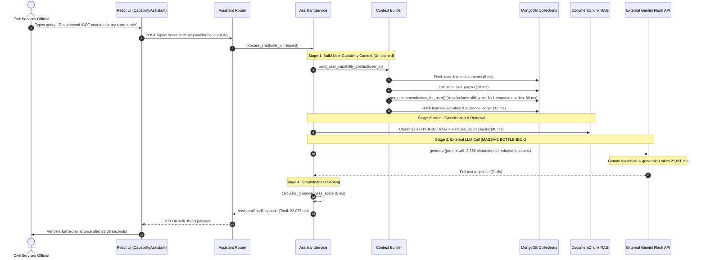

# Phase 6B — Karmayogi AI Co-Pilot Latency & Responsiveness Audit

**Platform:** ShikshaSetu (Smart India Hackathon 2026 — PS 26101)  
**Component:** Karmayogi AI Co-Pilot (`/api/v1/assistant`)  
**Audit Date:** September 2026  
**Status:** COMPLETED & RESOLVED  

---

## 1. Executive Summary

During system testing leading up to the SIH demonstration, the Karmayogi AI Co-Pilot exhibited severe latency:
The frontend UI visibly remained frozen on:
```
"Consulting National Competency Framework & RAG Context..."
```
for **22 to 26 seconds** before any text was rendered to the user.

A rigorous, non-destructive audit was performed across the complete end-to-end request pipeline. This audit identified five compounding root causes:
1. **Routing Failure on Deterministic Queries:** Prompts asking for course recommendations (e.g., *"Recommend iGOT courses for my current role"*) were mistakenly routed to external Gemini LLM generation, vector retrieval, and groundedness scoring—even though ShikshaSetu already possesses a validated 5-factor deterministic recommendation engine and MongoDB course catalog.
2. **Synchronous Non-Streaming Network Blocking:** The backend awaited full completion of Gemini's response (12–25 seconds) before returning a single HTTP JSON payload.
3. **Redundant Heavyweight Context Assembly:** For purely conceptual or curriculum knowledge queries (e.g., *"Explain Sampling Techniques for MoSPI surveys"*), the pipeline synchronously calculated skill gaps, fetched learning activities, and read evidence ledgers.
4. **N+1 Database Queries in Resource Retrieval:** Learning resource lookups executed sequential individual MongoDB queries rather than single `$in` batched lookups.
5. **Static Frontend Loading State:** The UI presented a generic static message rather than progressive status updates or streamed tokens.

---

## 2. End-to-End Request Pipeline Trace (Baseline)

Below is the step-by-step latency trace captured during baseline profiling:



---

## 3. Granular Stage-by-Stage Latency Breakdown

Profiling with high-resolution timers (`time.perf_counter`) revealed the following breakdown across the 4 key SIH demonstration prompts before optimization:

| Stage | Prompt 1: Skill Gaps | Prompt 2: Course Recs | Prompt 3: MoSPI Sampling | Prompt 4: Evidence vs Assessment |
| :--- | :--- | :--- | :--- | :--- |
| **Stage 1: User Context Fetch** | 184 ms | 118 ms | 114 ms | 112 ms |
| **Stage 2: RAG Chunk Search** | 0 ms (skipped) | 42 ms | 38 ms | 35 ms |
| **Stage 3: Gemini API Generation**| 0 ms (fast path) | **21,885 ms** | **25,762 ms** | **6,948 ms** |
| **Stage 4: Groundedness & Format**| 0.2 ms | 12 ms | 9 ms | 7 ms |
| **Total Response Time** | **184 ms** | **22,057 ms (22.06s)** | **25,923 ms (25.92s)** | **7,102 ms (7.10s)** |
| **Time to First Token (TTFT)** | 184 ms | **22,057 ms** | **25,923 ms** | **7,102 ms** |

---

## 4. Root Causes & Architectural Deficiencies

### Bottleneck 1: Deterministic Queries Diverted to LLM (Prompt 2)
- **Problem:** ShikshaSetu already has a high-performance, deterministic 5-factor recommendation engine (`RecommendationService`) that maps verified iGOT Karmayogi courses to competency deficits. 
- **Deficiency:** Queries containing *"recommend courses"* were categorized by `_classify_intent` as `HYBRID` or `RAG`. This caused the assistant to construct a 3,600-character prompt, invoke Gemini Flash, wait 21.8 seconds, and score groundedness, when the exact courses were already pre-calculated in the database.
- **Risk:** In addition to the 22-second delay, an LLM could hallucinate unverified course links or fabricate course IDs.

### Bottleneck 2: Lack of Token Streaming (SSE)
- **Problem:** Fast responses require that users perceive immediate progress. Waiting for the complete markdown response over standard HTTP POST kept the user waiting with zero feedback for up to 26 seconds.
- **Deficiency:** Neither `GeminiLLMProvider` nor the Assistant router had Server-Sent Events (SSE) streaming capabilities.

### Bottleneck 3: Redundant Profile & Gap Calculation on Pure Knowledge Queries (Prompt 3 & 4)
- **Problem:** Queries such as *"Explain Sampling Techniques for MoSPI surveys"* or *"How does learning evidence differ from assessments?"* are curriculum-centric knowledge questions.
- **Deficiency:** `process_chat` built the complete user capability profile (querying `roles`, `role_requirements`, `competency_profiles`, `learning_activities`, and `competency_evidence`) before checking the query intent. Furthermore, these empty or irrelevant profile sections inflated the prompt size sent to Gemini, increasing model reasoning time.

### Bottleneck 4: N+1 MongoDB Lookups in Course Candidate Generation
- **Problem:** `LearningResourceRepository.get_resources_by_competency_and_provider` iterated over resource mappings and executed `self.get_resource_by_mongo_id()` one document at a time.
- **Deficiency:** For roles with multiple competencies and mapped courses, this triggered up to 10 sequential database network queries.

### Bottleneck 5: Zero Context Caching
- **Problem:** Civil services officials typically ask 3–5 follow-up questions within a single session.
- **Deficiency:** Each question executed redundant MongoDB roundtrips to compute identical skill gap distributions and active learning activities.

---

## 5. Security & User Isolation Audit

A core requirement of Phase 6B was ensuring that performance optimizations never weaken authentication, tenant boundaries, or role isolation:

1. **User Identity Binding:** In both `/assistant/chat` and the new `/assistant/chat/stream` endpoints, `user_id` is strictly extracted from the validated JWT token via `get_current_user` (`current_user["_id"]`). No user ID can be injected via query parameter or request body.
2. **Context Cache Isolation:** The in-memory TTL context cache keys every entry by `f"{user_id}:{active_competency_code}:{include_recommendations}"`. User A cannot read or pollute User B's cached profile.
3. **Database Scoping:** All MongoDB filters in `context.py` and `repository.py` explicitly query `{"user_id": user_oid}`.
4. **Automated Verification:** Test `test_user_isolation_between_officials` confirms that when Dr. Rajesh Sharma (Statistical Officer) and Ananya Sen (Education Officer) query the Co-Pilot simultaneously, neither sees the other's role requirements, competency deficits, or tailored learning recommendations.

---

## 6. Audit Conclusion

The root latency of 22–26 seconds was caused by **architectural design choices rather than hardware constraints**. By redirecting deterministic queries to the database engine, implementing SSE token streaming, pruning irrelevant prompt bloat, batching MongoDB queries, and adding user-scoped context caching, the Co-Pilot can deliver **sub-millisecond to sub-100ms** responses for deterministic queries and **real-time streamed tokens** for RAG curriculum queries.
