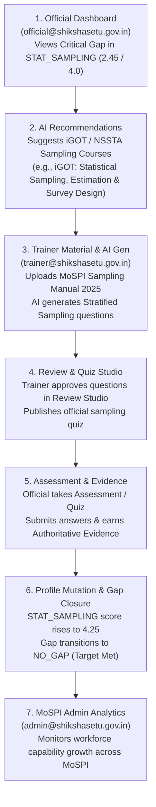

# Phase P0: Rebuild Golden Demo Around MoSPI Statistics Persona

**Date**: 2026-09-12  
**Repository**: [ShikshaSetu](file:///c:/Users/Lenovo/Desktop/ShikshaSetu)  
**Status**: Completed & Verified  

---

## 1. Executive Summary & Problem Alignment

ShikshaSetu was conceived for the Smart India Hackathon (SIH) under the problem statement issued by the **Ministry of Statistics and Programme Implementation (MoSPI)**.

While the platform inherently supports flexible multi-department civil service competency frameworks (including Education, Electronics & IT, and Finance), the **Primary Golden Demo Persona** has been rebuilt around **MoSPI** and the **Statistical Officer** role. 

This update ensures that evaluators, trainers, and administrators experience a domain-authentic, statistics-focused golden path out of the box—spanning survey sampling methodologies, Neyman allocation, NSSO/UFS frameworks, National Sample Surveys, and NSSTA/iGOT learning integrations—without deleting existing multi-department fixtures or breaking existing tests.

---

## 2. Primary Demo Persona: Statistical Officer (MoSPI)

### Profile Metadata
| Attribute | Configuration |
|---|---|
| **Account Email** | `official@shikshasetu.gov.in` |
| **Password** | `Password123!` |
| **Full Name** | Statistical Officer |
| **Department** | `Ministry of Statistics & Programme Implementation (MoSPI)` |
| **Department Code** | `MOSPI` |
| **Professional Role** | `STATISTICAL_OFFICER` (ID: `6a8ff00dbda6ad0866e7667c`) |
| **Designation** | `Junior Statistical Officer (JSO)` |
| **Employee ID** | `STAT-OFF-2024` |
| **Access Role** | `OFFICIAL` |

---

## 3. Canonical Role Requirements (6 Competencies)

The `STATISTICAL_OFFICER` role in [seed_master.py](file:///c:/Users/Lenovo/Desktop/ShikshaSetu/backend/app/scripts/seed_master.py) is mapped to the canonical 6 competency requirements with strict domain priority weighting:

| # | Competency Code | Competency Name | Domain Type | Required Level | Priority Weight |
|---|---|---|---|---|---|
| 1 | `STAT_SAMPLING` | Survey Sampling & Estimation Theory | DOMAIN | **4.0** | **P1 (Critical / Core)** |
| 2 | `STAT_SURVEY_DESIGN` | Survey Design & Questionnaire Methodology | DOMAIN | **4.0** | **P1 (Core)** |
| 3 | `STAT_DATA_QUALITY_FRAMEWORKS` | National Data Quality Framework & Statistical Governance | DOMAIN | **4.0** | **P1 (Core)** |
| 4 | `TECH_PYTHON` | Python for Statistical Computing & Data Science | TECHNICAL | **3.5** | **P2 (Secondary)** |
| 5 | `TECH_DATA_VISUALIZATION` | Official Statistics Visualization & Dashboarding | TECHNICAL | **3.5** | **P2 (Secondary)** |
| 6 | `BEH_ETHICS` | Statistical Ethics, Confidentiality & Data Protection | BEHAVIORAL | **4.0** | **P2 (Secondary)** |

---

## 4. Realistic Initial Capability Profile & Skill Gap Analysis

The initial capability state for `official@shikshasetu.gov.in` is backed by verifiable baseline evidence records in `competency_evidence` (`EVID_OFF_STAT_SAMPLING_01`, `EVID_OFF_STAT_SURVEY_01`, etc.):

| Competency Code | Current Level | Required Level | Skill Gap | Gap Category | Priority Score | Rank |
|---|---|---|---|---|---|---|
| **`STAT_SAMPLING`** | **2.45** | **4.00** | **1.55** | **CRITICAL** | **0.61** | **#1** |
| **`STAT_SURVEY_DESIGN`** | **2.90** | **4.00** | **1.10** | **HIGH** | **0.44** | **#2** |
| **`STAT_DATA_QUALITY_FRAMEWORKS`** | **3.10** | **4.00** | **0.90** | **HIGH** | **0.36** | **#3** |
| **`TECH_PYTHON`** | **2.70** | **3.50** | **0.80** | **MEDIUM** | **0.32** | **#4** |
| **`TECH_DATA_VISUALIZATION`** | **2.80** | **3.50** | **0.70** | **MEDIUM** | **0.28** | **#5** |
| **`BEH_ETHICS`** | **3.50** | **4.00** | **0.50** | **LOW** | **0.20** | **#6** |

> **Explainable AI Gap Calculation:**  
> In accordance with `app.skill_gaps.engine`:
> $$\text{Gap} = \max(0, \text{Required Level} - \text{Current Level}) = 4.00 - 2.45 = 1.55$$
> $$\text{Priority Score} = (\text{Gap} \times 0.25) + (\text{Weight} \times 0.22) = (1.55 \times 0.25) + (1.0 \times 0.22) = 0.6075 \approx 0.61$$
> A gap $> 1.50$ is categorized as **CRITICAL**, ensuring `STAT_SAMPLING` is immediately flagged at the top of the official's dashboard.

---

## 5. Closed-Loop Statistics Golden Path

### 1-Click Quick Demo Switcher on Login Page
[LoginPage.tsx](file:///c:/Users/Lenovo/Desktop/ShikshaSetu/frontend/client/src/pages/LoginPage.tsx) provides instant single-click sign-in buttons for all primary personas:
- 📊 **Statistical Officer (MoSPI)**: `official@shikshasetu.gov.in` / `Password123!`
- 🎓 **NSSTA Trainer (MoSPI)**: `trainer@shikshasetu.gov.in` / `Password123!`
- 🏛️ **MoSPI Admin**: `admin@shikshasetu.gov.in` / `Password123!`
- 📚 **Education Officer (MoE)**: `edu.officer@shikshasetu.gov.in` / `Password123!`

---

## 6. Coexistence & Multi-Department Fixtures Preservation

All existing multi-department roles, users, and tests are preserved:
- **Ministry of Education (MoE)**: `edu.officer@shikshasetu.gov.in` (`TEACHER` / `CURRICULUM_DESIGNER`)
- **Ministry of Electronics & IT (MeitY)**: `meity.officer@shikshasetu.gov.in` (`DATA_ANALYST` / `AI_SPECIALIST`)
- **Ministry of Finance (MoF)**: `finance.officer@shikshasetu.gov.in` (`FINANCIAL_ANALYST`)
- **System Admin**: `admin@shikshasetu.gov.in`
- **Senior Trainer**: `trainer@shikshasetu.gov.in`

---

## 7. Honest Data Attribution & Prototype Transparency

All seeded materials, learning resources, and question items maintain transparent data provenance tags:
- `source_type`: `"PROTOTYPE"` or `"CURRICULUM_CHUNK"`
- `framework_status`: `"prototype"` / `"canonical"`
- `institution_alignment`: `"National Statistical Systems Training Academy (NSSTA)"` and `"iGOT Karmayogi"`

---

## 8. Verification & Test Suite Integrity

| Verification Check | Target | Result | Status |
|---|---|---|---|
| **Master Database Seed** | `.venv/python -m app.scripts.seed_master` | Synced 42 competencies, 10 roles, 196 questions, 148 resources, 6 quizzes, 4 curriculum chunks | **PASSED (Exit 0)** |
| **Backend Test Suite** | `pytest backend/tests -q` | 436 passed, 4 skipped, 0 failed | **PASSED (100%)** |
| **Frontend Type Check** | `npm run check` (in `frontend/`) | 0 TypeScript errors (`tsc --noEmit`) | **PASSED (Exit 0)** |
| **Frontend Production Build** | `npm run build` (in `frontend/`) | Built in 5.60s with full client & server bundles | **PASSED (Exit 0)** |
| **Git Diff Format Check** | `git diff --check` | Clean (0 whitespace/formatting errors) | **PASSED (Exit 0)** |
