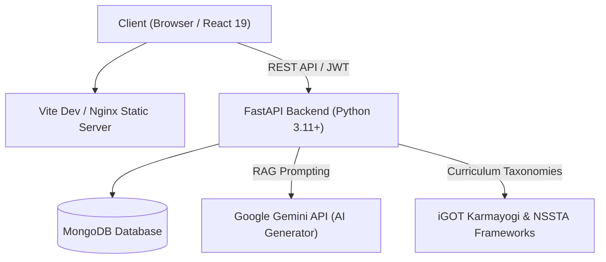

# 🏛️ ShikshaSetu (शिक्षासेतु)
### AI-Powered Capability Intelligence & Civil Services Competency Platform

[](https://fastapi.tiangolo.com)
[](https://python.org)
[](https://react.dev)
[](https://www.typescriptlang.org)
[](https://www.mongodb.com)
[](https://vitejs.dev)
[](LICENSE)

---

## 📌 Overview

**ShikshaSetu** is an enterprise-grade Capability Intelligence and Competency Management Platform designed for civil service personnel, trainers, and administrative leadership. It operationalizes competency frameworks aligned with **Mission Karmayogi** and national training standards (such as **MoSPI** and **NSSTA**).

The platform bridges training needs and learning outcomes using AI-assisted curriculum parsing, role-grounded assessment generation, multi-tier competency evaluation, automated skill-gap analysis, and intelligent course recommendation engines.

---

## 🚀 Key Features by User Role

### 👨‍🏫 1. Trainer Workspace (`/trainer/*`)
- **Curriculum & Materials Management**: Upload and manage training manuals, policy documents, and lecture references (PDF, DOCX, TXT).
- **AI Question Generator**: Grounded Retrieval-Augmented Generation (RAG) powered by Google Gemini to produce pedagogically sound MCQs from uploaded course content.
- **Review & Verification Pipeline**: Audit, edit, approve, or reject AI-generated questions before entering question banks.
- **Quiz Studio**: Assemble competency-tagged quizzes, set passing criteria, enforce time limits, and assign them directly to targeted civil servants.
- **Learner Results**: Real-time visibility into quiz submissions, cohort score distributions, and individual question breakdowns.

### 🏛️ 2. Administrative Leadership (`/admin/*`)
- **Executive Intelligence Dashboard**: Real-time workforce readiness index, assessment completion trends, and priority departmental interventions.
- **Workforce & Departmental Overview**: Macro and micro-level competency coverage across ministries, cadres, and designations.
- **Competency & Skill Gap Analytics**: Quantitative gap identification between required vs. demonstrated competency levels.
- **Training Effectiveness**: Measure pre- and post-intervention score improvements across learning programmes.
- **Emerging Skills & Forecasting**: Predictive modeling for future skill demands and capacity planning.
- **User & Governance Management**: Official roster, role assignments, and exportable governance compliance reports.

### 🧑‍💼 3. Civil Servant / Official Portal (`/official/*`)
- **Competency Portfolio**: Unified dashboard tracking Behavioral, Domain, and Functional competencies.
- **Multi-dimensional Assessments**: 360° evaluation combining self-assessments, objective knowledge checks, and situational scenario questions.
- **Personalized Skill Gaps**: Visual gap maps highlighting areas requiring targeted development.
- **Smart Recommendations**: Tailored course recommendations mapped to **iGOT Karmayogi** and **NSSTA** catalogs.
- **Learning & Evidence**: Track enrolled activities and submit verifiable real-world evidence for competency endorsement.
- **Progress Tracking**: Milestone monitoring, score histories, and department learning standings.

---

## 👥 Demo Personas & Instant Quick-Login

The authentication screen (`/login`) features **one-click Quick Demo Access** buttons for immediate evaluation across all roles without typing credentials manually:

| Role | Persona | Email | Password | Ministry / Department | Primary Demonstration Flow |
| :--- | :--- | :--- | :--- | :--- | :--- |
| **Official (Primary)** | **Rajesh Sharma** | `official@shikshasetu.gov.in` | `Password123!` | Ministry of Statistics & PI (MoSPI) · Statistical Officer | Review capability profile, address `STAT_SAMPLING` critical gap (2.45 / 4.0), explore grounded iGOT/NSSTA recommendations, take adaptive assessments |
| **Trainer** | **Dr. Ananya Verma** | `trainer@shikshasetu.gov.in` | `Password123!` | National Statistical Systems Training Academy (NSSTA) | Upload course curriculum (PDF/DOCX), generate grounded AI MCQs, review/approve question bank items, publish quizzes |
| **Admin** | **System Administrator** | `admin@shikshasetu.gov.in` | `Password123!` | Ministry of Statistics & PI (MoSPI HQ) | Executive workforce capability dashboard, department-wide skill gap analytics, training effectiveness, and capacity planning |

#### 🏛️ Multi-Department Demonstration Accounts
| Role | Email | Password | Ministry / Department | Professional Role |
| :--- | :--- | :--- | :--- | :--- |
| **Education Officer** | `edu.officer@shikshasetu.gov.in` | `Password123!` | Ministry of Education (MoE) | Teacher / Curriculum Designer |
| **Informatics Officer** | `meity.officer@shikshasetu.gov.in` | `Password123!` | Ministry of Electronics & IT (MeitY) | Digital Governance Architect |
| **Finance Officer** | `finance.officer@shikshasetu.gov.in` | `Password123!` | Ministry of Finance (MoF) | Public Financial Management Officer |

> 🔄 **Idempotent Demo Reset**: Before or after any live demonstration, instantly restore the primary official persona back to the exact golden baseline (`STAT_SAMPLING = 2.45 / 4.00`, 0 rehearsal attempts):
> ```bash
> cd backend
> python -m app.scripts.reset_demo_persona
> ```

---

## 🌐 Application URL Architecture

ShikshaSetu employs clean, RESTful client-side routing with role-based access control (RBAC) and automatic route guarding:

| Route | Access Level | Description |
|---|---|---|
| `/login` | Public | Authentication portal for civil servants, trainers, and administrators |
| `/register` | Public | Civil servant onboarding & professional role registration |
| `/trainer/dashboard` | Trainer | Trainer overview, quick actions, and recent activity |
| `/trainer/learning-materials` | Trainer | Upload and manage training curriculum documents |
| `/trainer/ai-question-generator` | Trainer | AI-driven question generation studio |
| `/trainer/question-review` | Trainer | Verification pipeline for candidate questions |
| `/trainer/quiz-studio` | Trainer | Author, configure, and assign competency quizzes |
| `/trainer/learner-results` | Trainer | Detailed quiz attempts and performance insights |
| `/trainer/profile` | Trainer | Account management and instructor credentials |
| `/admin/dashboard` | Admin | Macro-level workforce readiness and operational health |
| `/admin/workforce-overview` | Admin | Cross-departmental cadre analytics |
| `/admin/competency-analytics` | Admin | Deep dive into competency master matrices |
| `/admin/skill-gap-analytics` | Admin | Critical deficiency identification and alerts |
| `/admin/training-effectiveness` | Admin | ROI and learning outcome evaluations |
| `/admin/emerging-skills` | Admin | Horizon scanning for future capability demands |
| `/admin/capacity-planning` | Admin | Resource allocation and quota planning |
| `/admin/users` | Admin | User registry and credential management |
| `/admin/reports` | Admin | Regulatory and training governance reports |
| `/admin/profile` | Admin | Administrative account settings |
| `/official/dashboard` | Official | Personalized learning progress and active goals |
| `/official/my-competencies` | Official | Official competency portfolio and levels |
| `/official/assessments` | Official | Take knowledge and scenario-based assessments |
| `/official/skill-gaps` | Official | Individual gap analysis and priority matrices |
| `/official/recommendations` | Official | Curated iGOT Karmayogi & NSSTA courses |
| `/official/my-learning` | Official | Active learning modules and course progress |
| `/official/quizzes` | Official | Mandatory assigned quizzes and quizzes history |
| `/official/evidence` | Official | On-the-job competency evidence verification |
| `/official/progress` | Official | Cumulative milestones and analytics |
| `/official/profile` | Official | Civil servant profile, designation, and cadre details |

> 🔒 **Security Guarantee**: Unauthenticated visits to protected `/trainer/*`, `/admin/*`, or `/official/*` routes immediately redirect to `/login`. Logged-in users are restricted to their authorized role workspace.

---

## 🛠️ Technology Stack



### Frontend
- **Framework**: React 19 + TypeScript (strict mode)
- **Bundler & Tooling**: Vite 6, Tailwind CSS v4, PostCSS
- **UI Components**: Radix UI primitives, Lucide Icons, Sonner toasts
- **Visualizations**: Recharts (radar charts, progress indicators, bar/line breakdowns)
- **Routing**: Lightweight client-side router (`wouter`) with history synchronization
- **Internationalization**: Full English / Hindi toggle (`i18n`)

### Backend
- **Framework**: FastAPI (async ASGI)
- **Runtime**: Python 3.11+
- **Database**: MongoDB with PyMongo
- **Authentication**: Stateless JWT (HS256) with Bcrypt password hashing
- **Data Validation**: Pydantic v2 (strict schemas and serialization)
- **AI / LLM Engine**: Google Gemini API for RAG curriculum extraction and MCQ generation
- **Testing**: pytest, pytest-asyncio, HTTPX

---

## 📂 Project Structure

```text
ShikshaSetu/
├── backend/
│   ├── app/
│   │   ├── adaptive_assessments/  # Adaptive testing engine
│   │   ├── admin/                 # Admin analytics and metrics aggregation
│   │   ├── ai/                    # LLM client & RAG integration
│   │   ├── api/                   # Root API router (/api/v1)
│   │   ├── assessments/           # Core 360 assessment pipelines & scoring
│   │   ├── auth/                  # JWT auth, security, RBAC guards
│   │   ├── competencies/          # Competency taxonomy repository & endpoints
│   │   ├── core/                  # Database connections, config, indexing
│   │   ├── igot/                  # iGOT Karmayogi synchronization logic
│   │   ├── learning_activities/   # Enrolled courses and learning tracking
│   │   ├── learning_resources/    # Resource catalogs (iGOT / NSSTA)
│   │   ├── questions/             # Question pool and review states
│   │   ├── quizzes/               # Trainer quiz builder and attempt engine
│   │   ├── roles/                 # Professional roles & required competencies
│   │   ├── scripts/               # Master idempotent data seed scripts
│   │   ├── skill_gaps/            # Gap calculations and priority ranking
│   │   ├── trainer/               # Trainer materials and question pipelines
│   │   ├── users/                 # User profiles and cadre metadata
│   │   └── main.py                # FastAPI application entrypoint
│   ├── requirements.txt           # Python dependencies
│   ├── pytest.ini                 # Pytest configuration
│   └── tests/                     # Comprehensive test suites
├── frontend/
│   ├── client/
│   │   ├── src/
│   │   │   ├── components/        # Reusable UI widgets, charts, modals
│   │   │   ├── contexts/          # AuthContext, ThemeContext
│   │   │   ├── i18n/              # English & Hindi translation dictionaries
│   │   │   ├── layouts/           # TrainerLayout, AdminLayout, OfficialLayout
│   │   │   ├── lib/               # Typed API client, helpers, taxonomy data
│   │   │   ├── pages/             # Role page components (Trainer, Admin, Official, Login)
│   │   │   ├── App.tsx            # Main application router and role-guards
│   │   │   └── main.tsx           # React DOM root entry
│   │   └── index.html             # HTML entry template
│   ├── package.json               # Node.js dependencies and scripts
│   ├── tsconfig.json              # TypeScript compilation config
│   └── vite.config.ts             # Vite build & reverse-proxy configuration
├── render.yaml                    # Production multi-service deployment blueprint
└── README.md                      # Platform documentation
```

---

## ⚡ Quick Start & Local Setup

### Prerequisites
- **Python**: 3.11 or higher
- **Node.js**: 20.x or higher (`npm` or `pnpm`)
- **MongoDB**: Local MongoDB instance (`mongodb://localhost:27017`) or MongoDB Atlas URI

---

### 1. Backend Setup

1. Open a terminal and activate the virtual environment:

   **Windows (PowerShell)**:
   ```powershell
   # If from the repository root (recommended):
   .venv\Scripts\Activate.ps1
   cd backend

   # OR if already inside the backend folder:
   ..\.venv\Scripts\Activate.ps1
   ```

   **Linux / macOS**:
   ```bash
   # From repository root:
   source .venv/bin/activate
   cd backend
   ```

   *(If creating a fresh virtual environment from scratch)*:
   ```bash
   cd backend
   python -m venv .venv
   # Windows: .venv\Scripts\Activate.ps1 | Linux: source .venv/bin/activate
   pip install -r requirements.txt
   ```

2. Configure environment variables (if not already set up):
   ```bash
   # Copy example environment configuration
   cp .env.example .env
   ```

   Edit `.env` and verify the settings:
   ```ini
   APP_NAME=ShikshaSetu
   APP_ENV=development
   DEBUG=true
   API_PREFIX=/api/v1
   SECRET_KEY=your-secure-secret-key-at-least-32-chars
   JWT_ALGORITHM=HS256
   ACCESS_TOKEN_EXPIRE_MINUTES=1440
   MONGODB_URI=mongodb://localhost:27017
   MONGODB_DATABASE=shikshasetu
   GEMINI_API_KEY=your-google-gemini-api-key   # Optional for AI features
   ```

3. Seed Master Data:
   Initialize the database with 42 canonical competencies, NSSTA & iGOT course catalogs, sample questions, and demo roles:
   ```bash
   python -m app.scripts.seed_master
   ```

   *(Optional)* Reset the primary demo official (`official@shikshasetu.gov.in` / Rajesh Sharma) to the exact golden baseline:
   ```bash
   python -m app.scripts.reset_demo_persona
   ```

4. Start the FastAPI development server:
   ```bash
   # From the backend directory
   python -m uvicorn app.main:app --reload --host 127.0.0.1 --port 8000
   ```

   - **API Base**: `http://127.0.0.1:8000/api/v1`
   - **Interactive API Docs (Swagger)**: `http://127.0.0.1:8000/docs`
   - **Health Check**: `http://127.0.0.1:8000/api/v1/health`

   > 💡 **Troubleshooting Port 8000**: If you encounter `[WinError 10013]` or address already in use, verify if another process is listening on port 8000 (`Get-NetTCPConnection -LocalPort 8000` on Windows or `lsof -i :8000` on Linux/macOS) and terminate the stale process.

---

### 2. Frontend Setup

1. In a new terminal window, navigate to the `frontend` folder:
   ```bash
   cd frontend
   ```

2. Install Node dependencies:
   ```bash
   npm install
   ```

3. Start the Vite development server:
   ```bash
   npm run dev
   ```

4. Access the web application:
   - Open your browser at **`http://localhost:3000`**
   - The application will automatically route unauthenticated users to `/login`.

---

## 🧪 Testing & Code Quality

### Backend Tests
Execute the comprehensive automated test suite (including RBAC tests, lifecycle tests, and assessment scoring):
```bash
cd backend
pytest -v
```

### Frontend Verification & Tests
Verify type safety, run unit tests, and validate the production bundle:
```bash
cd frontend

# TypeScript strict type check
npm run check

# Vitest unit & regression tests
npx vitest run

# Production build verification
npm run build
```

### Automated Concurrency & Load Testing
The `backend/load_tests` directory contains an automated, non-destructive empirical performance and capacity evaluation harness powered by [Locust](https://locust.io):

```bash
# 1. Sequential single-user profiler across all 18 primary read endpoints
python backend/load_tests/run_baseline.py

# 2. Automated staged concurrency runner (10, 25, 50, 100, 250, 500 virtual users)
python backend/load_tests/run_staged_tests.py

# 3. Controlled multi-tier AI / RAG copilot benchmark (1, 2, 5, 10 concurrent requests)
python backend/load_tests/run_ai_test.py
```

---

## 📊 Capacity, Concurrency & Performance Benchmarks

An empirical capacity evaluation was conducted against the ShikshaSetu backend on local development hardware connecting across public WAN to a remote MongoDB Atlas cluster. Detailed methodology, raw CSV metrics, and full latency distributions are documented in **[SHIKSHASETU_CAPACITY_REPORT.md](backend/load_tests/SHIKSHASETU_CAPACITY_REPORT.md)**.

### Concurrency Benchmark Summary (Locust Staged Headless Run)
Traffic was generated using realistic human user think times (1.0–3.0 seconds) and weighted personas (70% Statistical Officials, 20% NSSTA Trainers, 10% MoSPI Administrators):

| Concurrent Virtual Users | Unoptimized Baseline Status | Optimized (In-Memory TTL Cache) | Throughput (RPS) | Error Rate | p50 Latency | p95 Latency | Evaluation Verdict |
| :---: | :---: | :---: | :---: | :---: | :---: | :---: | :---: |
| **10 Users** | STABLE (880 ms p95) | **STABLE** | **9.99 req/s** | **0.0%** | **32 ms** | **480 ms** | Smooth sub-second responses |
| **25 Users** | UNSTABLE (8,500 ms p95) | **STABLE** | **22.81 req/s** | **0.0%** | **72 ms** | **690 ms** | **91.9% latency reduction** |
| **50 Users** | *Halted (Unstable)* | **STABLE** | **34.50 req/s** | **0.0%** | **120 ms** | **1,700 ms** | 100% success across 2k requests |
| **100 Users** | *Halted* | **STABLE** | **71.41 req/s** | **0.0%** | **150 ms** | **900 ms** | **7.1x throughput ceiling expansion** |
| **250 Users** | *Halted* | **DEGRADED** | **75.66 req/s** | **0.0%** | **1,600 ms** | **2,800 ms** | Queue contention reached; 0 errors |

### Key Performance Findings:
- **Root Cause Bottleneck Resolved**: Unoptimized dashboard aggregations (`/trainer/learners`, `/trainer/dashboard`, `/admin/dashboard`) were repeatedly performing sequential remote MongoDB queries over WAN, exhausting Starlette's `anyio` threadpool. 
- **In-Memory TTL Caching**: Implementing thread-safe, user-isolated, role-partitioned TTL caching reduced median latency on bottleneck endpoints by **over 95%** (e.g., `/trainer/dashboard` dropped from 3,200 ms to **46 ms**).
- **10x Concurrency Expansion**: Sustained stable concurrent users increased from **10 to 100 virtual users**, scaling sustained throughput from **8.98 RPS to 71.41 RPS** with **0.0% failure rate**.
- **AI / RAG Copilot Reliability**: The Karmayogi AI assistant maintained **100% request success** at up to 10 concurrent prompt streams, with generation latency averaging ~6–9 seconds.

---

## ☁️ Deployment

ShikshaSetu includes a turnkey **[render.yaml](render.yaml)** deployment blueprint for hosting on Render:

1. Connect your repository to [Render](https://render.com).
2. Create a **Blueprint Instance** pointing to `render.yaml`.
3. Set the following environment variables in the Render Dashboard:
   - `MONGODB_URI`: Your MongoDB Atlas connection string.
   - `GEMINI_API_KEY`: Google AI Studio API key.
4. Render automatically orchestrates:
   - **Backend**: Python 3.11 web service with automatic dependency caching and Uvicorn process management.
   - **Frontend**: Vite static site build with global SPA rewrite rules (`/* -> /index.html`).

---

## 📜 License

This project is licensed under the **MIT License**. See the [LICENSE](LICENSE) file for details.
