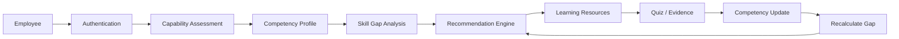
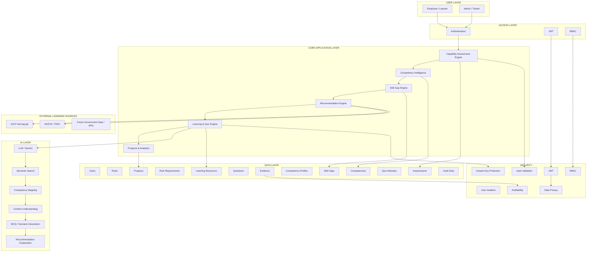
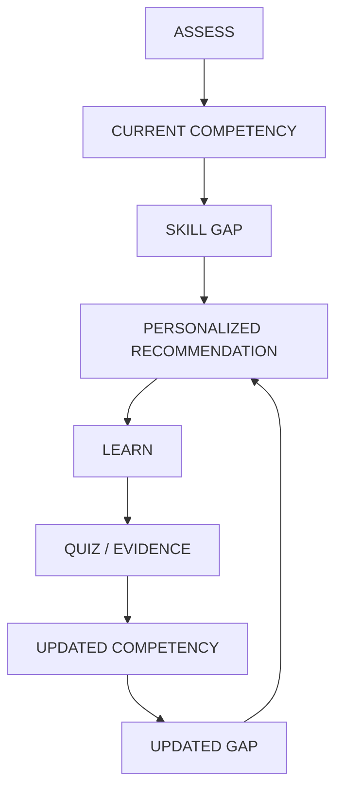

<div align="center">


# KarmSetu — AI-Powered Competency & Learning Intelligence Platform

**Skills Today • Stronger Tomorrow**

*Assess Competencies • Identify Skill Gaps • Learn • Measure Improvement*

</div>

[](https://www.sih.gov.in/)
[](https://www.sih.gov.in/)
[](https://fastapi.tiangolo.com)
[](https://react.dev)
[](https://ai.google.dev/)
[](https://www.mongodb.com/)
[](https://fastapi.tiangolo.com/#openapi)
[](https://jwt.io/)
[]()

Architecture • Core Workflow • AI Engine • Assessment • Recommendations • Quiz Engine • Repository • Quickstart • API • Testing • Roadmap

---

## Table of Contents

1. [Executive Summary](#1-executive-summary)
2. [Existing Problem](#2-existing-problem)
3. [KarmSetu Solution](#3-karmsetu-solution)
4. [Innovation & Uniqueness](#4-innovation--uniqueness)
5. [Core System Architecture](#5-core-system-architecture)
6. [Competency Intelligence Engine](#6-competency-intelligence-engine)
7. [Personalized Recommendation Engine](#7-personalized-recommendation-engine)
8. [Learning & Quiz Engine](#8-learning--quiz-engine)
9. [Continuous Learning Loop](#9-continuous-learning-loop)
10. [AI / LLM Architecture](#10-ai--llm-architecture)
11. [Security & Governance](#11-security--governance)
12. [Demo User Journey](#12-demo-user-journey)
13. [Repository Structure](#13-repository-structure)
14. [Quickstart](#14-quickstart)
15. [API Documentation](#15-api-documentation)
16. [Testing & Validation](#16-testing--validation)
17. [Deployment](#17-deployment)
18. [Roadmap](#18-roadmap)
19. [Technology Stack](#19-technology-stack)
20. [License](#20-license)

---

## 1. Executive Summary

Competency management is difficult when organizations rely on generic training, ad hoc assessments, and disconnected learning records. Skill gaps are not always visible until too late, learning recommendations are often not tied to evidence, and progression is hard to measure across time.

KarmSetu brings those moving parts together in one platform: it assesses current competency, identifies gaps, recommends targeted learning, and re-evaluates the user over time. The goal is not just to deliver content, but to connect capability assessment, role expectations, evidence, and learning in a continuous loop.

The project currently represents a prototype foundation for that operating model: a real FastAPI backend, a React front end, and a competency intelligence engine that computes user role-fit and learning priorities from structured data and evidence.

```text
TRADITIONAL APPROACH

❌ Generic training
❌ Manual skill-gap identification
❌ Disconnected assessments
❌ Fragmented learning resources
❌ No continuous competency feedback

TRANSFORMED INTO

KARMSETU

✅ Competency-based assessment
✅ Evidence-driven skill-gap analysis
✅ Personalized recommendations
✅ Unified learning discovery
✅ AI-generated quizzes from material
✅ Continuous competency improvement
```

---

## 2. Existing Problem

The core pain is not just lack of learning content; it is the absence of a connected learning intelligence loop.

| Existing Challenge | Impact |
|---|---|
| Unclear competency gaps | Training may not target actual needs |
| Generic learning | Low personalization and weak role relevance |
| Fragmented resources | Difficult discovery across sources |
| Assessment disconnected from learning | Improvement is hard to measure |
| No continuous feedback | Competency profiles become stale quickly |

KarmSetu addresses this by making the employee journey explicit: assess, identify gap, recommend, learn, test, and update capability.

---

## 3. KarmSetu Solution

KarmSetu is designed as a unified workflow for employees and administrators in the official statistical ecosystem.

Employee
→ Authentication
→ Capability Assessment
→ Competency Profile
→ Skill Gap Analysis
→ Recommendation Engine
→ Learning / Evidence
→ Quiz / Validation
→ Competency Update
→ Recalculated Gap
→ Updated Recommendation



This loop is the central product idea: the system should learn from evidence, not just rank static content.

---

## 4. Innovation & Uniqueness

- Competency-first learning
- Evidence-based competency scoring
- Role-aware skill-gap analysis
- Personalized learning recommendations
- Unified recommendation abstraction across multiple providers
- AI-generated quizzes from learning material
- Explainable recommendation rationale
- Continuous competency feedback loop
- Dynamic competency profile updates
- Human-controlled deterministic scoring and governance

> AI supports intelligence; backend logic remains the system of record. The deterministic backend controls scoring, gap calculation, role alignment, and security decisions.

---

## 5. Core System Architecture



---

## 6. Competency Intelligence Engine

The platform models competency as a structured capability state rather than a single score in isolation.

- Competency framework: a normalized set of skill areas and capability definitions
- Role requirements: expected levels for a role or function
- Current competency: user’s observed or assessed capability level
- Required competency: desired role-aligned benchmark
- Gap calculation: required minus current, with prioritization by impact
- Evidence aggregation: assessment results, quiz outcomes, and learning records contribute to the profile

The project includes a prototype competency scale that is intentionally explicit and not an official MoSPI or iGOT standard:

Prototype competency scale — not an official MoSPI/iGOT competency scale.

1 = Awareness
2 = Basic
3 = Intermediate
4 = Advanced
5 = Expert

This is a workable prototype model for product logic and demonstration, and it remains deliberately separated from official government taxonomies.

---

## 7. Personalized Recommendation Engine

The recommendation engine works over a common learning-resource abstraction. Both sources are represented under a single recommendation system:

- provider = IGOT
- resource_type = COURSE
- provider = NSSTA
- resource_type = TRAINING_PROGRAMME

Recommendation factors may include:

- Competency match
- Skill-gap priority
- Role relevance
- Difficulty / level
- Prerequisites
- Learning history
- TPAC relevance

The ranking is deterministic and backend-driven. AI may enrich the explanation text with a user-facing rationale such as “Why this recommendation?” but the recommendation logic itself remains governed by the application rules and stored evidence.

---

## 8. Learning & Quiz Engine

The platform includes a documented workflow for turning training material into measurable learning evidence.

```text
Upload Learning Material
→ Content Extraction
→ Chunking
→ AI Understanding
→ MCQ / Scenario Generation
→ Quiz
→ Server-side Scoring
→ Evidence
→ Competency Update
```

Implemented project behavior includes:

- Upload of PDF, DOCX, PPTX, and TXT material
- Text extraction and cleaning
- Chunking and semantic retrieval support
- AI-based question generation from content
- Quiz creation tied to competency codes
- Server-side scoring
- Hidden correct answers from the client layer
- Duplicate-submission protections and attempt traceability
- Evidence linkage to competencies

This is a strong foundation for a learning loop, but the repository deliberately does not claim broader autonomous decision capabilities beyond the implemented backend rules and AI-support layers.

---

## 9. Continuous Learning Loop

This is the core product loop.



The product vision is to continuously narrow skill gaps with each learning and assessment cycle, rather than treating learning as a one-time event.

---

## 10. AI / LLM Architecture

The repository includes AI capabilities, but they are intentionally bounded.

AI can:

- Understand content
- Extract concepts
- Generate questions
- Generate explanations
- Perform semantic matching
- Assist recommendation explanations

AI should not directly control:

- Authentication
- Authorization
- Final competency score
- Skill-gap calculation
- Security decisions
- Database permissions

```text
AI = INTELLIGENCE SUPPORT
Backend Rules = SYSTEM OF RECORD
```

This separation is important. The platform treats AI as a decision-support layer rather than as an ungoverned authority over user data or scoring.

---

## 11. Security & Governance

The implemented security model includes:

- JWT authentication
- RBAC enforcement via dependency checks
- User ownership and isolation for personal data
- Server-side scoring and answer key protection
- Input validation through FastAPI/Pydantic schemas
- Duplicate-submission prevention in assessment and quiz flows
- Append-only evidence handling where implemented
- Auditability through stored records and activity metadata
- Data privacy awareness in scope and access boundaries

The project does not claim broad compliance certifications or formal government security approval; the documented controls reflect the implemented backend behavior in this repository.

---

## 12. Demo User Journey

### Employee Journey

Employee Login
→ Select / Confirm Role
→ Take Capability Assessment
→ View Competency Profile
→ View Skill Gaps
→ Receive Personalized Recommendations
→ Access Learning Resources
→ Complete Learning
→ Take AI Quiz
→ Generate Evidence
→ Competency Updated
→ Skill Gap Recalculated

### Admin Journey

Admin Login
→ User / Role Management
→ Competency Overview
→ Learning / Assessment Analytics
→ Monitoring & Reports

---

## 13. Repository Structure

```text
ShikshaSetu/
├── ARCHITECTURE.md
├── PROJECT_CONTEXT.md
├── RAG.md
├── README.md
├── render.yaml
├── backend/
│   ├── .env.example
│   ├── app/
│   │   ├── adaptive_assessments/
│   │   ├── admin/
│   │   ├── ai/
│   │   ├── api/
│   │   ├── assessments/
│   │   ├── assistant/
│   │   ├── auth/
│   │   ├── capability_assessments/
│   │   ├── competencies/
│   │   ├── core/
│   │   ├── igot/
│   │   ├── learning_activities/
│   │   ├── learning_resources/
│   │   ├── main.py
│   │   ├── questions/
│   │   ├── quizzes/
│   │   ├── rag/
│   │   ├── roles/
│   │   ├── scripts/
│   │   ├── skill_gaps/
│   │   ├── trainer/
│   │   └── users/
│   ├── conftest.py
│   ├── requirements.txt
│   ├── pytest.ini
│   ├── tests/
│   └── uploads/
├── frontend/
│   ├── client/
│   │   ├── src/
│   │   └── index.html
│   ├── components.json
│   ├── package.json
│   ├── pnpm-lock.yaml
│   ├── server/
│   ├── tsconfig.json
│   ├── tsconfig.node.json
│   └── vite.config.ts
├── docs/
│   └── ...
└── backend/load_tests/
    └── ...
```

---

## 14. Quickstart

### Prerequisites

- Python 3.11 or higher
- Node.js 20+ and npm or pnpm
- MongoDB instance reachable by the backend

### 1) Backend setup

```bash
cd backend
python -m venv .venv
source .venv/bin/activate
pip install -r requirements.txt
cp .env.example .env
```

Use the project example config as a baseline. The repository includes backend/.env.example with runtime settings such as:

```env
APP_NAME=ShikshaSetu Backend
APP_ENV=development
DEBUG=true
MONGODB_URI=mongodb://localhost:27017
MONGODB_DATABASE=shikshasetu
API_PREFIX=/api/v1
JWT_SECRET=change-this-development-secret-32
JWT_ALGORITHM=HS256
JWT_ACCESS_TOKEN_EXPIRE_MINUTES=60
LLM_PROVIDER=mock
EMBEDDING_PROVIDER=mock
IGOT_INTEGRATION_MODE=prototype
```

### 2) Database and seed data

The backend includes role and competency seed scripts, along with assessment and training-data initialization patterns.

```bash
cd backend
python -m app.scripts.seed_framework
```

Additional prototype data and learning-material flows are supported in the app modules under `backend/app/scripts` and the AI/trainer flows.

### 3) Start the backend

```bash
cd backend
source .venv/bin/activate
uvicorn app.main:app --reload --host 0.0.0.0 --port 8000
```

API endpoints are served under `/api/v1` and Swagger is available at:

- http://127.0.0.1:8000/docs
- http://127.0.0.1:8000/redoc

### 4) Start the frontend

```bash
cd frontend
npm install
npm run dev
```

The Vite app will run in development mode, and the browser can be opened on the local Vite URL shown in the terminal.

---

## 15. API Documentation

The repository exposes production-style REST endpoints through FastAPI. Swagger/OpenAPI is available via the FastAPI docs at `/docs` when the backend is running.

| Domain | Endpoint | Method | Purpose |
|---|---|---|---|
| Health | `/api/v1/health` | GET | Service and database health check |
| Authentication | `/api/v1/auth/register` | POST | Register a user |
| Authentication | `/api/v1/auth/login` | POST | Login and issue JWT |
| Authentication | `/api/v1/auth/me` | GET | Current user profile |
| Users | `/api/v1/users/me` | GET | Current user details |
| Users | `/api/v1/users/me` | PUT | Update user profile |
| Users | `/api/v1/users/me/evidence` | GET | Evidence ledger |
| Roles | `/api/v1/roles` | GET | List role definitions |
| Roles | `/api/v1/roles/{role_id}` | GET | Fetch role |
| Roles | `/api/v1/roles/{role_id}/requirements` | GET | Role requirements |
| Competencies | `/api/v1/competencies` | GET | List competencies |
| Competencies | `/api/v1/competencies/me` | GET | User competency map |
| Competencies | `/api/v1/competencies/{competency_id}` | GET | Competency detail |
| Assessments | `/api/v1/assessments` | POST | Start an assessment |
| Assessments | `/api/v1/assessments/{attempt_id}` | GET | Fetch attempt state |
| Assessments | `/api/v1/assessments/{attempt_id}/submit` | POST | Submit attempt |
| Skill Gaps | `/api/v1/skill-gaps/me` | GET | User skill-gap summary |
| Recommendations | `/api/v1/recommendations/me` | GET | Personalized recommendations |
| Recommendations | `/api/v1/recommendations/resources/{resource_id}` | GET | Learning resource detail |
| Recommendations | `/api/v1/recommendations/competencies/{competency_code}/resources` | GET | Competency resources |
| Recommendations | `/api/v1/recommendations/resources/unmapped` | GET | Unmapped resources |
| Learning Materials | `/api/v1/learning-materials/upload` | POST | Upload training material |
| Learning Materials | `/api/v1/learning-materials/{material_id}` | GET | Material metadata |
| Quizzes | `/api/v1/quizzes/assigned` | GET | Assigned public quizzes |
| Quizzes | `/api/v1/quizzes` | POST | Create a quiz |
| Quizzes | `/api/v1/quizzes/{quiz_id}` | GET | Fetch quiz |
| Quizzes | `/api/v1/quizzes/{quiz_id}/submit` | POST | Submit answers |
| Admin | `/api/v1/admin/dashboard` | GET | Executive dashboard |
| Admin | `/api/v1/admin/workforce` | GET | Workforce analytics |
| Admin | `/api/v1/admin/competencies` | GET | Competency analytics |
| Admin | `/api/v1/admin/skill-gaps` | GET | Skill-gap analytics |
| Admin | `/api/v1/admin/users` | GET | User directory |
| Admin | `/api/v1/admin/reports` | GET | Report data |
| Admin | `/api/v1/admin/users/{user_id}/profile` | GET | Workforce profile |
| Assistant | `/api/v1/assistant/chat` | POST | User chat assistant |
| Assistant | `/api/v1/assistant/chat/stream` | POST | Streaming assistant response |
| Assistant | `/api/v1/assistant/feedback` | POST | Feedback submission |
| iGOT | `/api/v1/igot/status` | GET | Prototype iGOT status |
| iGOT | `/api/v1/igot/courses` | GET | iGOT resource listing |

> Implementation note: some external integrations are deliberately marked as prototype and not live government API integrations.

---

## 16. Testing & Validation

The repository contains a substantial pytest suite for the backend, including tests for:

- Health and connectivity
- Authentication and authorization
- RBAC and access controls
- Skill-gap logic and competency calculations
- Assessment flows and scoring
- Quiz submission and evidence generation
- AI and security constraints
- Recommendation integrity
- Regression and lifecycle testing

Representative files include:

- `backend/tests/test_health.py`
- `backend/tests/test_auth.py`
- `backend/tests/test_skill_gaps_engine.py`
- `backend/tests/test_quizzes.py`
- `backend/tests/test_ai_security.py`
- `backend/tests/test_rbac.py`
- `backend/tests/test_assessment_scoring.py`
- `backend/tests/test_recommendations_e2e.py`

Run locally:

```bash
cd backend
python -m pip install -r requirements.txt
pytest
```

This project does not claim a blanket “100% passing” status. The repository contains real automated coverage, but verification should be executed in the local environment with the project dependencies installed.

---

## 17. Deployment

The project includes a concrete Render deployment blueprint in `render.yaml`.

### Prototype deployment

- FastAPI backend deployed as a Python web service
- React frontend built as a static site
- MongoDB connection via environment variables
- Direct environment-variable configuration for `MONGODB_URI`, `GEMINI_API_KEY`, and runtime settings

### Future production architecture

- Official government API integration and synchronized metadata refresh
- Stronger enterprise identity and access controls
- Enhanced audit and compliance reporting
- Production-grade observability, alerting, and environment isolation

This is a prototype-first deployment model, not an official government production deployment.

---

## 18. Roadmap

### Phase 1 — Foundation
- Authentication and user identity
- Role and competency framework
- User profile and baseline data

### Phase 2 — Assessment
- Capability assessment engine
- Question bank and competency mapping
- Evidence records and scoring

### Phase 3 — Intelligence
- Skill-gap engine
- Recommendation engine
- Administrative analytics and workforce views

### Phase 4 — Learning
- Learning resource abstraction
- iGOT prototype catalog integration
- NSSTA / TPAC metadata-driven recommendation layer
- Quiz generation and evidence capture

### Phase 5 — Intelligence Loop
- Competency updates
- Reassessment and re-ranking
- Adaptive recommendations based on evidence

### Phase 6 — Government Integration
- Official API and feeds
- Data synchronization workflows
- Enterprise deployment and operational monitoring

Planned / Future Integration:

- Live iGOT API or authoritative government feed integration
- Official NSSTA / TPAC programme synchronization
- Additional enterprise-grade IAM and audit controls

---

## 19. Technology Stack

| Layer | Technology |
|---|---|
| Frontend | React / TypeScript |
| Backend | FastAPI / Python |
| Database | MongoDB |
| AI | LLM / Gemini support |
| Authentication | JWT / RBAC |
| API | REST / OpenAPI via FastAPI |
| Deployment | Render blueprint |

---

## 20. License

License not yet defined.

---

<div align="center">

Built for Smart India Hackathon 2026  
Problem Statement 26101  
Team StatForge

**Assess • Learn • Grow • Serve a Stronger India**

</div>
