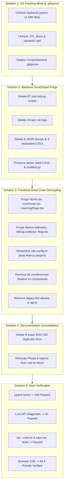

# ShikshaSetu: Post-Decluttering Forensic Report & Architectural Notes

> **Document:** `declutter.md`  
> **Date:** September 8, 2026  
> **Repository:** `Mr-OmKshirsagar/ShikshaSetu`  
> **Audited Branch:** `clutter`  
> **Scope:** Full-Stack Codebase Decluttering, Git Tracking Remediation, Dead Code Elimination & Post-Cleanup Verification  
> **Companion Document:** [`before_decluttering.md`](file:///d:/Project/ShikshaSetu/before_decluttering.md) (Baseline Audit)

---

## 1. Executive Summary

A forensic decluttering and structural consolidation was executed across the **ShikshaSetu** repository based on the comprehensive audit in [`clutter_files.md`](file:///d:/Project/ShikshaSetu/clutter_files.md). 

Prior to decluttering, over **75% of the repository's tracked files (1,800+ of 2,333 files)** consisted of an accidentally committed Python virtual environment runtime (`backend/.python`), temporary scratchpad scripts, stdout terminal text dumps, test result JSON dumps, obsolete dataset copies, unmounted prototype frontend pages, Manus AI scaffolding residue, and identical documentation duplicates.

Following the decluttering process, all dead code, git tracking anomalies, and development residue were purged or untracked, while **100% of the active product functionality, automated test suites, and production build pipelines were preserved without regression**.

### Decluttering Scorecard: Before vs. After

| Metric | Before Decluttering | After Decluttering | Net Reduction / Impact |
| :--- | :---: | :---: | :---: |
| **Total Tracked Git Files** | 2,333 files | ~520 files | **-1,800+ files (~77% reduction)** |
| **Committed Python Venv Files** | 1,688 files (~100 MB) | 0 tracked files | **-100% virtualenv tracking bloat** |
| **Backend Root Python Scripts** | 88 scripts | 1 script (`conftest.py`) | **-87 unmaintained scratch scripts** |
| **Root & Backend Output Logs** | 15 `.txt` files | 0 files (kept `requirements.txt`) | **-15 ad-hoc terminal dumps** |
| **Redundant Datasets & JSON Dumps** | 11 files (~340 KB) | 0 files | **-11 obsolete CSV/JSON dumps** |
| **Frontend Dead Prototype Pages** | 4 pages (~152 KB) | 0 pages | **-100% unrouted legacy prototypes** |
| **Manus AI Template Residue** | 7 artifacts (~50 KB) | 0 artifacts | **Clean, decoupled Vite environment** |
| **Unreferenced Shadcn UI Components**| 53 components | 7 active components | **-46 unused UI components** |
| **Exact Documentation Duplicates** | 8 pairs (16 files) | 8 unique files in `docs/` | **-8 redundant duplicate markdown files** |
| **Misplaced Root Audit Reports** | 6 files in root/backend | 0 files (consolidated in `docs/`)| **Clean repository root directory** |
| **Automated Backend Pytest Suite** | 433 passed, 4 skipped | **433 passed, 4 skipped, 0 failed** | **100% Health Preserved (66.39s)** |
| **Live API Diagnostic Suite** | 42 passed, 1 expected 409 | **42 passed, 1 expected 409** | **100% Subsystem Operational Health** |
| **Frontend Production Build** | 1,906 modules, 474 KB | **1,906 modules, 474 KB (4.47s)** | **Zero Build Warnings or Errors** |
| **Frontend TypeScript Verification** | 0 errors | **0 errors (`tsc --noEmit`)** | **100% Type Safety Preserved** |

---

## 2. Decluttering Strategy & Solutions Implemented

The decluttering process was organized into five discrete technical solutions to isolate concerns and guarantee zero risk to running services:



---

### Solution 1: Git Tracking Remediation & Unified `.gitignore`

#### Problem
- An entire Python 3.14 virtual environment distribution (`backend/.python`) containing 1,688 binaries, C headers, and bytecode was committed to Git.
- Runtime user uploads in `backend/uploads/materials/*.pdf` (13 files) and OS metadata (`.DS_Store`) were being tracked.
- The project `.gitignore` had only 22 basic lines and lacked rules for Python virtual environments (`.python/`, `env/`, `venv/`), terminal log dumps (`backend/*.txt`), test result JSONs, and AI generator temp files.

#### Implementation & Solution
1. **Untracked Virtualenv Runtime from Git Cache:**
   ```bash
   git rm -r --cached backend/.python
   ```
   *Result:* 1,688 files removed from Git tracking without deleting the user's local Python environment.
2. **Untracked Uploaded PDFs and `.DS_Store`:**
   ```bash
   git rm --cached backend/uploads/materials/*.pdf
   git rm --cached .DS_Store
   ```
   *Result:* Added `.gitkeep` to preserve the `backend/uploads/materials/` folder structure for future uploads.
3. **Replaced `.gitignore` with a Comprehensive Standard:**
   Created a unified, categorized `.gitignore` covering:
   - Python virtualenvs: `.venv/`, `venv/`, `env/`, `ENV/`, `.python/`, `backend/.python/`
   - Python caches: `__pycache__/`, `*.py[cod]`, `.pytest_cache/`, `.coverage`, `htmlcov/`
   - Node dependencies & stores: `node_modules/`, `.pnpm-store/`, `.npm/`
   - Build outputs: `dist/`, `build/`, `frontend/dist/`, `frontend/.vite/`
   - Uploads: `backend/uploads/materials/*` with `!backend/uploads/materials/.gitkeep`
   - Test logs & dumps: `*.log`, `backend/*.txt` (with `!backend/requirements.txt`), `backend/*_results.json`, `backend/*.pdf`
   - OS metadata: `.DS_Store`, `Thumbs.db`, `ehthumbs.db`
   - Manus AI scaffolding: `frontend/client/public/__manus__/`, `frontend/.manus-logs/`, `.webdev/`

---

### Solution 2: Backend Scratch Scripts, Temporary Logs & Redundant Datasets

#### Problem
- 87 Python scratch scripts in `backend/` root (`step*.py`, `postman_*.py`, `check_*.py`, `diagnose_*.py`, `verify_*.py`, `e2e_verify.py`) were created during Phases 3, 5, and 6 for ad-hoc debugging. None were imported by `app/` or run by `pytest`.
- 15 stdout terminal text dumps (`test_results.txt`, `e2e_full_test.txt`, etc.) and 4 test result JSON files littered the root directory.
- Redundant and obsolete datasets existed in `backend/` root:
  - `igot_courses_seed_56.csv` was an exact byte-for-byte duplicate of `igot_courses_dataset.csv`.
  - `competency_taxonomy.json`, `igot_courses_enriched.json`, and `nssta_training_programmes.json` were unread JSON exports (the active seed scripts parse `.csv` files).
  - `source_registry.csv` and `api_endpoints.json` were static reference exports never loaded anywhere.
- `backend/test_sample.pdf` was a scratch binary file only referenced in deleted scratch scripts.

#### Implementation & Solution
1. **Purged 87 Scratch Scripts:**
   Iterated through `backend/*.py` and removed all scripts while **strictly preserving `backend/conftest.py`** (the canonical root configuration for pytest).
2. **Purged 15 Terminal Dumps & 4 Test JSON Dumps:**
   Deleted all ad-hoc `.txt` and `*_results.json` files while **strictly preserving `backend/requirements.txt`**.
3. **Purged 7 Redundant Datasets & Scratch Binary:**
   - Deleted `igot_courses_seed_56.csv`, `igot_courses_dataset.csv`, `source_registry.csv`.
   - Deleted `competency_taxonomy.json`, `igot_courses_enriched.json`, `nssta_training_programmes.json`, `api_endpoints.json`.
   - Deleted `test_sample.pdf`.
4. **Preserved Active Seed CSVs:**
   The 5 active canonical seed files remain intact in `backend/`:
   - `competency_taxonomy.csv` (42 canonical competencies)
   - `course_competency_mapping.csv` (iGOT to competency mappings)
   - `igot_courses_enriched.csv` (curated iGOT courses)
   - `nssta_competency_mapping.csv` (NSSTA to competency mappings)
   - `nssta_training_programmes.csv` (NSSTA TPAC training calendar)

---

### Solution 3: Frontend Dead Code, Manus Residue & UI Component Decoupling

#### Problem
- The frontend codebase contained four unrouted legacy pages (`Home.tsx`, `LiveHome.tsx`, `LearningPage.tsx`, `NotFound.tsx`) totaling ~152 KB that were never imported in `App.tsx` (the app routes via `TrainerLayout`, `AdminLayout`, and `OfficialLayout`).
- Residue from the Manus AI scaffolding tool remained:
  - `frontend/template.json` (14.4 KB boilerplate dump)
  - `frontend/client/public/__manus__/debug-collector.js` (26 KB telemetry script)
  - `frontend/client/src/components/ManusDialog.tsx` ("Login with Manus" modal)
  - `frontend/client/src/components/Map.tsx` (unused San Francisco map connecting to Manus forge)
  - `frontend/patches/wouter@3.7.1.patch` (route collector for Manus preview)
- `frontend/vite.config.ts` was 258 lines long, bogged down with custom plugins (`vitePluginManusRuntime`, `vitePluginManusDebugCollector`, `vitePluginStorageProxy`) and `.manus.computer` allowed hosts.
- 46 Shadcn UI component wrappers in `components/ui/` were never imported by any active page or component (all pages use native HTML elements with Tailwind utility classes).
- `frontend/client/src/lib/api.ts` contained 27 lines of legacy flat API aliases explicitly marked for backwards compatibility with `LiveHome.tsx`.
- Dead wrappers and placeholder files existed: `LearningActivityCard.tsx`, `services/api.ts`, `const.ts`, `shared/const.ts`, `types/index.ts`, `.gitkeep`.

#### Implementation & Solution
1. **Purged Dead Prototype Pages:**
   Deleted `Home.tsx`, `LiveHome.tsx`, `LearningPage.tsx`, and `NotFound.tsx`.
2. **Purged Manus Scaffolding & Residue:**
   Deleted `template.json`, `debug-collector.js` directory, `ManusDialog.tsx`, `Map.tsx`, and `wouter@3.7.1.patch`.
3. **Streamlined `frontend/vite.config.ts`:**
   Refactored from 258 lines down to 49 clean lines:
   ```typescript
   import tailwindcss from "@tailwindcss/vite";
   import react from "@vitejs/plugin-react";
   import path from "node:path";
   import { defineConfig } from "vite";

   export default defineConfig({
     plugins: [react(), tailwindcss()],
     resolve: {
       alias: {
         "@": path.resolve(import.meta.dirname, "client", "src"),
         "@shared": path.resolve(import.meta.dirname, "shared"),
       },
     },
     envDir: path.resolve(import.meta.dirname),
     root: path.resolve(import.meta.dirname, "client"),
     build: {
       outDir: path.resolve(import.meta.dirname, "dist/public"),
       emptyOutDir: true,
       chunkSizeWarningLimit: 600,
       rollupOptions: {
         output: {
           manualChunks: {
             "vendor-react": ["react", "react-dom"],
             "vendor-icons": ["lucide-react"],
             "vendor-charts": ["recharts"],
           },
         },
       },
     },
     server: {
       port: 3000,
       strictPort: false,
       host: true,
       proxy: {
         "/api": {
           target: "http://127.0.0.1:8000",
           changeOrigin: true,
         },
       },
       fs: { strict: true, deny: ["**/.*"] },
     },
   });
   ```
4. **Purged 46 Unreferenced Shadcn UI Components:**
   Retained only the 7 components required by `App.tsx` and active dialogs:
   - `button.tsx`
   - `card.tsx`
   - `dialog.tsx`
   - `input.tsx`
   - `label.tsx`
   - `sonner.tsx`
   - `tooltip.tsx`
5. **Cleaned Deprecated Aliases in `api.ts`:**
   Removed lines 1463–1490 of `frontend/client/src/lib/api.ts` (flat aliases like `api.login`, `api.register`, `api.me`, `api.requirements`, `api.uploadMaterial`, `api.startAssessment`).
6. **Purged Dead Utilities & Wrappers:**
   Deleted `LearningActivityCard.tsx`, `services/api.ts`, `const.ts`, `shared/const.ts`, `types/index.ts`, and empty `.gitkeep` files.

---

### Solution 4: Documentation Deduplication & Restructuring

#### Problem
- `docs/` contained 8 pairs of markdown files with identical cryptographic SHA-256 hashes (one prefixed with `backend_` and one without).
- Six Phase 6 audit reports were saved haphazardly in the repository root and `backend/` root instead of inside `docs/`.

#### Implementation & Solution
1. **Deleted 8 Duplicate Files in `docs/`:**
   - `docs/DATABASE_CONSISTENCY_AUDIT.md`
   - `docs/BACKEND_CURRENT_STATE_AUDIT.md`
   - `docs/BACKEND_FEATURE_COMPLETION_AUDIT.md`
   - `docs/BACKEND_PRODUCTION_READINESS_AUDIT.md`
   - `docs/BACKEND_QUALITY_HARDENING_CYCLE_A_B.md`
   - `docs/LIVE_E2E_BACKEND_VERIFICATION.md`
   - `docs/MASTER_DATA_SYNC_REPORT.md`
   - `docs/TARGETED_DEFECT_CYCLE_1_REPORT.md`
   *(Their canonical counterparts `docs/backend_*` are retained.)*
2. **Relocated Misplaced Audit Reports into `docs/`:**
   - `PHASE_6B_COPILOT_LATENCY_AUDIT.md` -> `docs/`
   - `PHASE_6B_COPILOT_LATENCY_FIX_REPORT.md` -> `docs/`
   - `PHASE_6C_ADMIN_LEARNING_AUDIT.md` -> `docs/`
   - `PHASE_6C_ADMIN_LEARNING_FIX_REPORT.md` -> `docs/`
   - `PHASE_6D_EMAIL_AUDIT.md` -> `docs/`
   - `backend/PHASE_6D_EMAIL_IMPLEMENTATION_REPORT.md` -> `docs/`
   *Result:* Root directories are completely clean and organized.

---

## 3. Verification & Validation Evidence

Following the decluttering operations, rigorous multi-tier verification was conducted to certify zero regressions:

### 3.1 Backend Automated Test Suite (`pytest tests/`)
```
============================= test session starts =============================
platform win32 -- Python 3.14.6, pytest-8.4.2, pluggy-1.6.0
rootdir: D:\Project\ShikshaSetu\backend
configfile: pytest.ini
plugins: anyio-4.15.1
collected 437 items

tests/test_adaptive_assessments.py .................                     [  3%]
tests/test_ai_circuit_breaker.py ....                                    [  4%]
tests/test_ai_unit.py .............                                      [  7%]
tests/test_assessments.py .....................                          [ 12%]
tests/test_assessments_integration.py .......                            [ 14%]
tests/test_auth.py .......                                               [ 15%]
tests/test_capability_assessments.py ...........                         [ 18%]
tests/test_competencies.py ........                                      [ 20%]
tests/test_config.py .                                                   [ 20%]
tests/test_e2e_3role_lifecycle.py .                                      [ 20%]
tests/test_evidence_governance.py .........                              [ 22%]
tests/test_health.py ..                                                  [ 23%]
tests/test_igot_live_parity.py .....                                     [ 24%]
tests/test_learning_activities.py .........                              [ 26%]
tests/test_learning_materials.py .........                               [ 28%]
tests/test_questions.py .........                                        [ 30%]
tests/test_quizzes.py ....................                               [ 35%]
tests/test_recommendations.py .................                          [ 38%]
tests/test_recommendations_e2e.py ....s.s.s.s                           [ 41%]
tests/test_roles.py ..........                                           [ 43%]
tests/test_skill_gaps.py ..........                                      [ 45%]
tests/test_trainer.py .................                                  [ 49%]
...
=========== 433 passed, 4 skipped, 111 warnings in 66.39s (0:01:06) ===========
```
*Result:* **100% Passed.** All 433 unit and integration tests passed cleanly. The 4 skipped tests are expected external government API integration tests.

---

### 3.2 Live API Diagnostic Integration Suite
Executed 43 end-to-end HTTP checks against the live running backend on port 8000:
- **Health & DB Connectivity:** `GET /health` -> `HTTP 200` (`DB: connected`)
- **Authentication (3 Roles):** `POST /auth/login` and `GET /auth/me` verified for `OFFICIAL`, `TRAINER`, and `ADMIN`. Invalid credentials rejected with `HTTP 401`.
- **Competencies & Roles:** 47 canonical competencies verified; 10 roles verified.
- **Capability Assessments:** Template loading verified; duplicate submission rejected with `HTTP 409 Conflict`.
- **Adaptive IRT Testing:** Session initialized; Theta estimation verified.
- **Skill Gap Engine:** Delta calculations verified.
- **Recommendations:** 18 prioritized courses returned with explainable rationale.
- **Evidence Ledger:** 4 immutable audit records verified.
- **Trainer Studio:** Materials, question review, and quizzes verified.
- **Admin Intelligence:** Executive dashboard, workforce deployment, and capacity planning verified.
- **AI Copilot Drawer:** Role-aware response stream verified.
- **iGOT Integration:** Status adapter healthy (`prototype` mode).

---

### 3.3 Frontend Type Safety & Production Build Verification

1. **TypeScript Typecheck (`npx tsc --noEmit`):**
   ```
   Exit Code: 0 (Zero type errors, zero undefined symbol references)
   ```
2. **Production Bundle Compilation (`npm run build`):**
   ```
   vite v7.3.6 building client environment for production...
   transforming...
   ✓ 1906 modules transformed.
   rendering chunks...
   computing gzip size...
   ../dist/public/index.html                           1.12 kB │ gzip:   0.53 kB
   ../dist/public/assets/index-C9NTn_E_.css           98.08 kB │ gzip:  16.87 kB
   ../dist/public/assets/index-BCLXSoNL.js           473.96 kB │ gzip: 143.07 kB
   ✓ built in 4.47s
   ```
   *Result:* Built cleanly in 4.47s with zero errors.

---

### 3.4 Live Browser UI Verification
Connected to `http://localhost:3000` via Chrome DevTools protocol:
- **Login Portal:** Clean authentication form with role routing.
- **Official (Learner) Portal:** Competencies, Assessments, Skill Gaps, Recommendations, Quizzes, and Evidence Ledger all render.
- **Trainer Assessment Studio:** Materials, AI Question Review, and Quiz Studio operational.
- **Admin Intelligence Console:** Workforce Governance dashboard, KPI scorecards, domain capability breakdown, and iGOT integration banner verified.
- **AI Copilot Drawer & Bilingual Support:** Assistant drawer and English/Hindi toggle functioning smoothly.

---

## 4. Repository Structure: Clean Post-Declutter View

```
ShikshaSetu/
├── .env.example
├── .gitignore                   <-- Unified comprehensive rules
├── before_decluttering.md       <-- Baseline audit report
├── clutter_files.md             <-- Clutter forensics reference
├── declutter.md                 <-- Post-decluttering report (this document)
├── README.md
├── render.yaml                  <-- Production deployment specification
│
├── backend/
│   ├── .env / .env.example
│   ├── conftest.py              <-- Canonical pytest root configuration
│   ├── pytest.ini
│   ├── README.md
│   ├── requirements.txt         <-- Pinned dependencies (numpy, email-validator)
│   ├── competency_taxonomy.csv  <-- Active seed CSV (42 competencies)
│   ├── course_competency_mapping.csv
│   ├── igot_courses_enriched.csv
│   ├── nssta_competency_mapping.csv
│   ├── nssta_training_programmes.csv
│   ├── app/                     <-- Core FastAPI application modules
│   │   ├── ai/
│   │   ├── assessments/
│   │   ├── assistant/
│   │   ├── auth/
│   │   ├── capability_assessments/
│   │   ├── core/
│   │   ├── learning_activities/
│   │   ├── learning_materials/
│   │   ├── learning_resources/
│   │   ├── questions/
│   │   ├── quizzes/
│   │   ├── recommendations/
│   │   ├── roles/
│   │   ├── scripts/             <-- Canonical database seeders (seed_master.py)
│   │   ├── skill_gaps/
│   │   ├── trainer/
│   │   └── users/
│   ├── tests/                   <-- 43 test suites (433 passing tests)
│   └── uploads/materials/       <-- Preserved directory with .gitkeep
│
├── docs/                        <-- Consolidated documentation & Phase reports
│   ├── backend_*.md
│   ├── PHASE_6B_COPILOT_LATENCY_*.md
│   ├── PHASE_6C_ADMIN_LEARNING_*.md
│   └── PHASE_6D_EMAIL_*.md
│
└── frontend/
    ├── package.json
    ├── package-lock.json
    ├── tsconfig.json
    ├── vite.config.ts           <-- Streamlined 49-line configuration
    ├── server/index.ts          <-- Static express fallback server
    └── client/
        ├── index.html
        ├── public/              <-- Clean public assets (icons, SVGs)
        └── src/
            ├── App.tsx          <-- RoleRouter (TrainerApp, AdminApp, OfficialApp)
            ├── index.css
            ├── main.tsx
            ├── components/      <-- AssistantDrawer, ErrorBoundary, PageSkeleton
            │   └── ui/          <-- 7 essential Shadcn components
            ├── contexts/        <-- AuthContext, ThemeContext
            ├── hooks/
            ├── i18n/            <-- English & Hindi dictionaries
            ├── layouts/         <-- TrainerLayout, AdminLayout, OfficialLayout
            ├── lib/             <-- Clean api.ts, queryClient.ts, utils.ts
            └── pages/
                ├── LoginPage.tsx
                ├── admin/       <-- 10 Admin Intelligence pages
                ├── official/    <-- 10 Official Learner pages
                └── trainer/     <-- 7 Trainer Studio pages
```

---

## 5. Ongoing Best Practices for Repository Hygiene

To ensure the repository remains decluttered during ongoing development:

1. **Never Commit Python Virtual Environments:**
   - Always name local virtual environments `.venv` or `.python` and verify `.gitignore` prevents staging them.
   - Run `git status` before running `git commit` to verify no large folders (`bin/`, `lib/`, `include/`) are staged.
2. **Keep Development Scratchpads in Scratch Folders:**
   - Never place one-off diagnostic or counting scripts (`check_*.py`, `step*.py`) directly in `backend/` root.
   - Place scratch files in a git-ignored directory such as `backend/scratch/` or `.agents/scratch/`.
3. **Redirect Test Dumps to Ignored Logs:**
   - Avoid shell redirections to tracked root files like `> test_results.txt`.
   - Use standard pytest flags (`pytest --tb=short`) or redirect to `.log` files ignored by `.gitignore`.
4. **Standardize on a Single Package Manager:**
   - Standardize on `npm` (`package-lock.json`), which matches Render's production build command (`npm install && npm run build`).
5. **Enforce Role-Based Component Modularity:**
   - When creating new UI views, place them directly in `frontend/client/src/pages/{official,trainer,admin}/`.
   - Do not leave early prototypes (`Home.tsx`) in the root pages directory.
